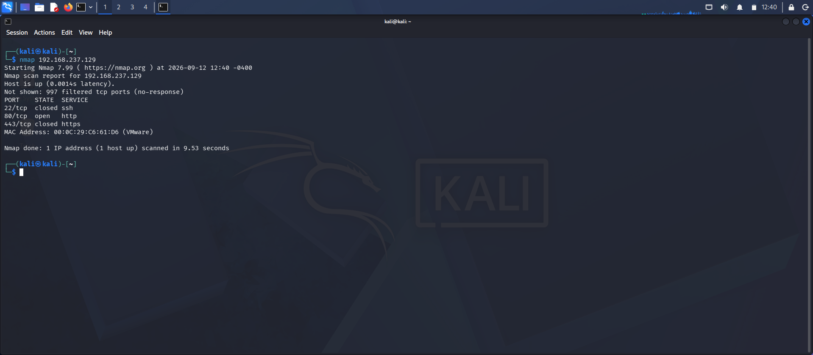
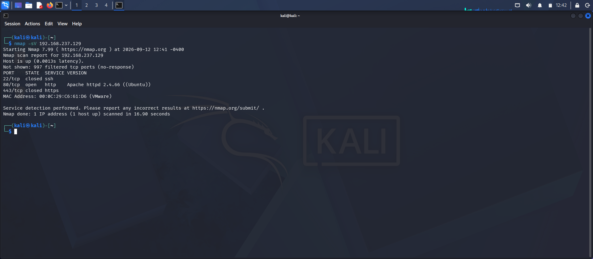
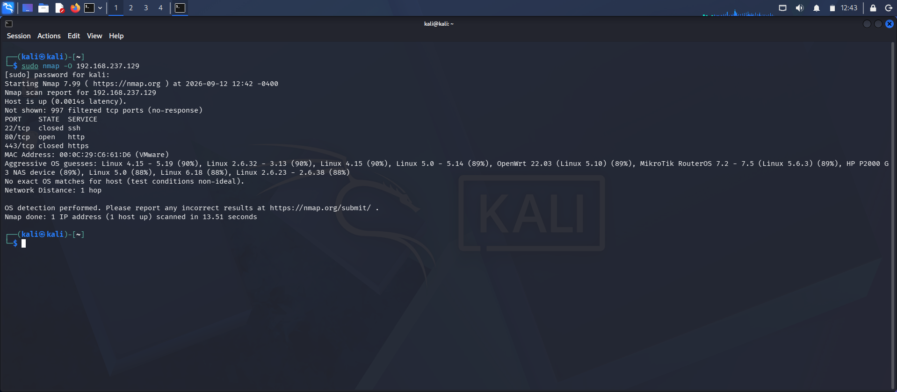

# OASIS Infobyte Security Analyst Internship — Task 1: Network Scanning with Nmap

## Context

As part of the OASIS Infobyte Security Analyst Internship, this task focused on performing basic network reconnaissance and identifying services running on a target system.

A Kali Linux machine was used as the testing machine, and an Ubuntu machine was used as the target in a controlled virtual lab environment.

## Goal

The goal was to use **Nmap** to:

* Identify open ports on the target.
* Identify running services and their versions.
* Perform basic operating system detection.
* Record and document the scan results.

## Lab Environment

| Component       | Details            |
| --------------- | ------------------ |
| Testing Machine | Kali Linux         |
| Target Machine  | Ubuntu Linux       |
| Tool            | Nmap 7.99          |
| Target IP       | 192.168.237.129    |
| Network         | VMware Host-Only   |
| Web Server      | Apache HTTP Server |

## Tools

### Nmap

Nmap was used because it is a standard network scanning and reconnaissance tool used to identify open ports, services, versions, and other information about a target system.

## Scans Performed

### 1. Basic Port Scan

A basic Nmap scan was performed to identify open ports on the Ubuntu target.

**Finding:** TCP port 80 was identified as open.



### 2. Service and Version Detection

Nmap service and version detection was used to identify the service running on the open port.

**Finding:** Port 80 was running Apache HTTP Server.



### 3. Operating System Detection

Nmap OS detection was performed to gather information about the target operating system.

**Finding:** Nmap attempted to identify the operating system, but an exact OS match was not available from the scan.



## Findings

The scan identified:

* **Port 80/tcp:** Open
* **Service:** HTTP
* **Web Server:** Apache HTTP Server
* **Web Page:** Apache2 Ubuntu Default Page
* **Port 443/tcp:** Closed
* Additional HTTP enumeration showed restricted responses such as `403 Forbidden` for some server paths.

The detailed Nmap output is available in [`nmap_scan_results.txt`](nmap_scan_results.txt).

## Recommendations

Based on the scan results:

1. Only required services should be exposed on the target system.
2. Unnecessary ports and services should be disabled.
3. Apache should be kept updated with security patches.
4. Web server configuration should be reviewed to ensure sensitive directories and files are not unnecessarily accessible.
5. Regular network scanning should be performed to identify unexpected services.

## Reflection

This task helped me understand the basics of network reconnaissance using Nmap. I learned how to identify open ports, determine running services and versions, and perform basic OS detection.

It also showed me how reconnaissance can help a security analyst understand the attack surface of a system before investigating or securing it.

## Evidence

The `screenshots/` folder contains the practical evidence from the lab:

* `01-basic-scan.png` — Basic port scan
* `02-service-version-scan.png` — Service and version detection
* `03-os-detection.png` — OS detection

The raw scan output is stored in:

* `nmap_scan_results.txt`

## Repository Structure

```text
CyberSecurity-Task1-NetworkScanningNmap/
│
├── screenshots/
│   ├── 01-basic-scan.png
│   ├── 02-service-version-scan.png
│   └── 03-os-detection.png
│
├── README.md
└── nmap_scan_results.txt
```
